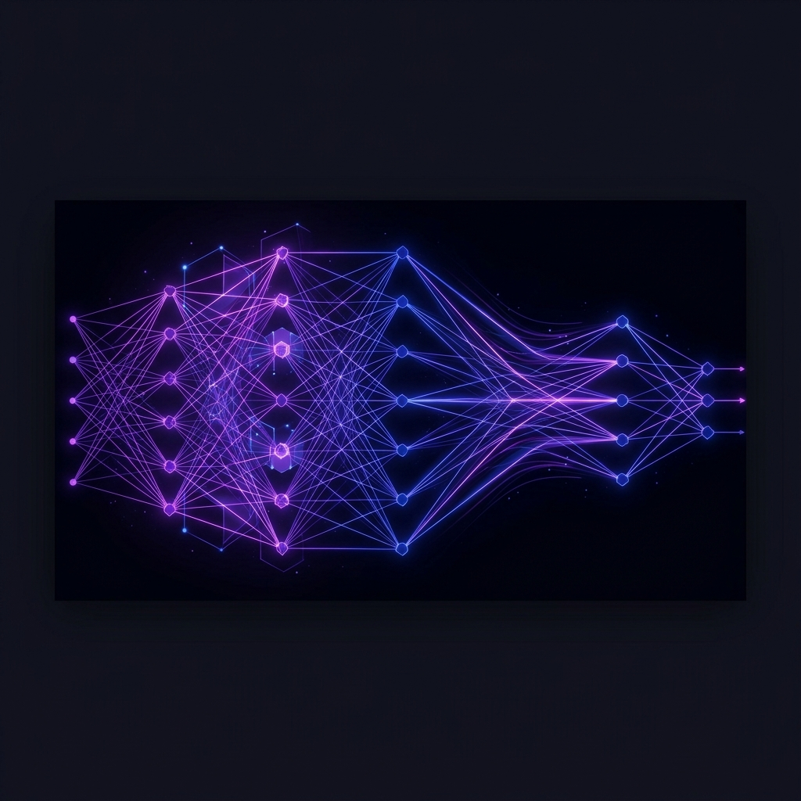

  

<h1 align="center">Meisam Mahmoodi 🧠</h1>

  

  REVERSE-ENGINEERING LARGE LANGUAGE MODELS • EXTRACTING SEMANTIC CONCEPTS • CAUSAL AI

  
  
  

---

### 🧐 About Me

I am a **Computer Science PhD Candidate** at the **University of Adelaide**, Australia, working within the **Causal AI Group** (AIML) under the supervision of **Prof. Javen Qinfeng Shi**. 

My research sits at the intersection of **Mechanistic Interpretability**, **Concept Component Analysis (ConCA)**, and **Causal AI**. I am dedicated to reverse-engineering deep neural networks to discover how high-level semantic concepts are represented and computed inside Large Language Models (LLMs). Rather than relying on simple token-level correlations, my work focuses on extracting, aligning, and steering robust, causally grounded latent concepts.

---

### 🧠 Research Focus

*   **Mechanistic Interpretability**: Decoding the internal activations, residual stream representations, and attention circuits of Transformer models to understand neural computation.
*   **Concept Component Analysis (ConCA)**: Utilizing unsupervised linear unmixing and sparse priors (e.g., Sparse ConCA) as a theoretically grounded framework to extract human-interpretable concept log-posteriors from model weights.
*   **Causal Representation Learning**: Building methods that bridge statistical correlation and causal mechanisms to enable robust cross-model transfer and targeted concept steering.

---

### 🚀 Active Project: [SetConCA](https://github.com/MeiisamMahmoodii/SetConCA_v3) (Set-Constrained Concept Component Analysis)

**SetConCA** (Set-Constrained Concept Component Analysis) is an interpretability framework designed to learn set-level sparse concept codes by training on semantic sets of paraphrases. By training on sets of sentences that share semantic meaning but differ lexically, the model learns to encode underlying concepts rather than overfitting to specific tokens.

#### 🔧 Key Features & Pipeline
1.  **Stricter Semantic-Set Construction**: Avoids lexical copying by banning keyword overlap and generating rewrites across multiple word-count bands using diverse LLMs (Llama, Gemma, Qwen).
2.  **Scalable vLLM Multi-GPU Dataset Generation**: Automates multi-process and multi-GPU shard generation, merging attempts with validation checks.
3.  **Cross-Model Activation Sweep Grid**: Sweeps residual streams of Llama 3, Gemma 3, and Qwen 3 at 20%, 60%, and 90% depth layers to extract multi-view activation banks.
4.  **Transfer & Steering baselines**: Benchmarks trained spaces against standard Sparse Autoencoders (SAEs), evaluating representation transfer with Procrustes, Ridge, and MLP bridges, and testing activation-level concept steering.

👉 Check out the active codebase at [SetConCA_v3](https://github.com/MeiisamMahmoodii/SetConCA_v3).

---

### 📚 Publications & Archive

*   **Utilizing Large Language Models for DDoS Attack Detection** (2024)
    *Meisam Mahmoodi* | *2024 OPJU International Technology Conference (OTCON)*
    *   Introduces a framework converting network traffic features into semantic natural language descriptions, allowing LLMs to identify DDoS threats via zero-shot reasoning and parameter-efficient fine-tuning.
    *   [Google Scholar Citation Link](https://scholar.google.com/citations?hl=en&user=IOXPIqEAAAAJ)

*   *Archived Work*: Prior-Data Fitted Networks (TabPFN), Implicit Structure Discovery for Causal Prediction (ISD-CP), and Zero-Shot Causal Integrity Auditing frameworks.

---

### 🛠️ Languages & Tools

  
   
  

---

### 📊 GitHub Analytics

  
  

